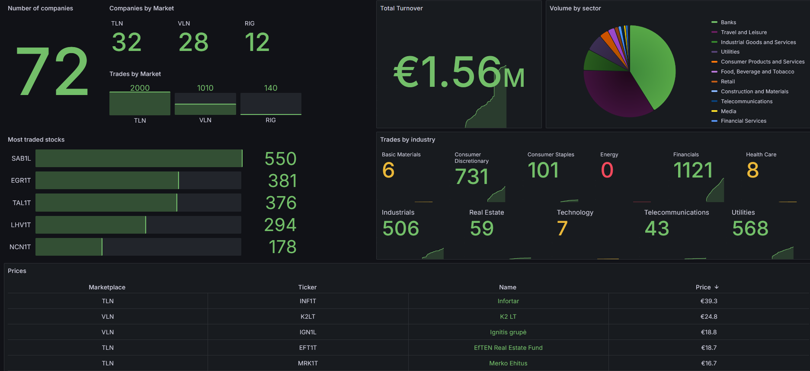

# Baltic Stock Exporter

*Aggregate and publish NASDAQ Baltic stock metrics to Prometheus, enabling visualization and graphing in Grafana.*

---



## Introduction

Baltic Stock Exporter is a program written in Go that collects stock metrics from NASDAQ Baltic and publishes them to Prometheus. This data can then be visualized and graphed in Grafana, allowing you to monitor and analyze the performance of various stocks.

The exporter is designed to be easy to set up and use, making it a valuable tool for investors, traders, and anyone interested in tracking the Baltic stock market.
Though some basic Linux knowledgment is beneficial to set up the whole environment.

**PS! Keep in mind that Nasdaq Baltic reports stock data with a 15 minute delay, so this isn't suitable when you need real-time tracking.**

---

## Features

- Automated collection of NASDAQ Baltic stocks
- Collects stock metrics about its:
  - Price
  - Trades
  - Volume
  - Turnover 

- Supports all lists
- Seamless integration with Grafana for data visualization and graphing via PromQL
- Works only on market open time, to avoid redundant scraping (holidays not implemented yet)
- 15 minute report delay is accounted for in the program, so metrics will get pushed with a custom timestamp

---

## Environment

* Baltic Stock Exporter
* Prometheus
* Grafana for visualization

---

## Run

To run the exporter, you need to:

1. Download the [latest release](https://github.com/LumePart/Baltic-Stock-Exporter/releases/latest)

2. Give the right permissions to the program and move the release to /usr/bin/prometheus-balticstock-exporter:

```
sudo chown root:root ./prometheus-balticstock-exporter && sudo chmod +x ./prometheus-balticstock-exporter
sudo mv ./prometheus-balticstock-exporter /usr/bin/prometheus-balticstock-exporter
```
3. Make a cron job so it executes on market open time (program will automatically exit on market close)

```
crontab -e
```
Copy this to the last line:
```
15 10 * * 1-5 /usr/bin/prometheus-balticstock-exporter
```
4. Add a job in /etc/prometheus/prometheus.yml to scrape the exporter

```
- job_name: stocks

    scrape_interval: 1m

    static_configs:
      - targets : ['localhost:33171']
```
**PS! It isn't recommended to set the scrape_interval lower than 1m, because NASDAQ Baltic updates its data every minute**

5. Connect grafana with prometheus

## Use Cases
Here are a couple of use cases, which the exporter can accomplish:
1. Portfolio tracking.
2. Specific industry or supersector tracking
3. In depth analysis of various stocks, via different visualization options
4. Notifications when stock is below/above specific price
5. Stock movement forecasting, using tools like [Prophet](https://facebook.github.io/prophet/).

---

## Contributing

Contributions are always welcome! If you have any suggestions, bug reports, or feature requests, please open an issue or submit a pull request.
